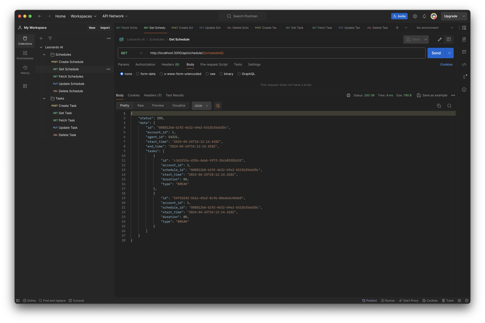

# Leonardo AI Techincal Test

Hey 👋  Thank you for taking the time to review my work 🙂

## Notes

- The REST API is built using Express, Prisma and PosgreSQL.
- The entry point of the app is `src/index.ts`.
- Routes can be found at `src/routes` and controllers can be found at `src/controllers`.
- Controllers provide CRUD capabilities for both Schedules and tasks.
- Prisma is used as an ORM and db models are defined in `prisma/schema.prisma`.
- API supports one to many relationship between schedules and tasks. `schedule_id` can be passed to the `createTask` endpoint.
- Middleware for error hadnling and schema validation (using zod). 
- Full coverage in unit testing using Jest/Supertest.

## Getting Started

To run the project you will need to:
1. Clone the repository:
```bash
   git clone <repository-url>
```

2. Install dependencies:
```bash
cd leonardo-ai-test
npm install
```

3. Set up the database:
    - You will need a running version of postgresql for the server to connect to. For this, you can use the provided docker compose file by running `docker-compose up -d` from the root of the project.
    - Configure the database connection in the .env file (see `.env.example`)
    - Run database migrations

```bash
prisma migrate dev --name init
```

4. Run the server
```bash
npm start
```

## Endpoints

#### Schedules

- `GET /schedule`: Fetch all schedules
- `GET /schedule/:id`: Fetch a schedule by ID
- `POST /schedule`: Create a new schedule
- `PUT /schedule/:id`: Update a schedule by ID
- `DELETE /schedule/:id`: Delete a schedule by ID

#### Tasks

- `GET /task`: Fetch all tasks
- `GET /task/:id`: Fetch a task by ID
- `POST /task`: Create a new task
- `PUT /task/:id`: Update a task by ID
- `DELETE /task/:id`: Delete a task by ID

### Swagger UI
While the server is running, you can accesss the served swagger docs at [http://localhost:3000/api-docs/#/](http://localhost:3000/api-docs/#/)


## Testing

### Unit Testing
Run unit tests with Jest:

```bash
npm test
```
### Testing vis Postman

I have also provided a postman collection that can be easily imported to manually test the API. This can be found at `postman/LeonardoAI.postman_collection.json`

The postman collection uses dynamic global variables so you don't need to worry about handling IDs. If you first create a schedule or task, you will then be able to make further GET, PUT and DELETE requests without needing to manually alter the request body.



---